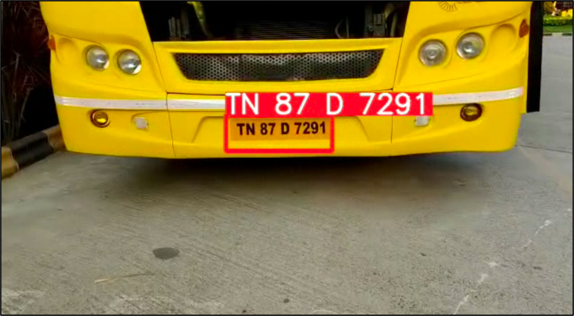

<H1 align="center">FasterTag</H1>
<H3 align="center">Stopless ANPR Vehicle Management System</H3>

## Use Cases
- Toll Collection
- Parking Management
- Campus Authorization

## Steps to run Code

- Clone the repository
```
git clone https://github.com/Sahil-Amritkar/FasterTag.git
```
- Goto the cloned folder.
```
cd FasterTag
```
- Install the dependecies
```
pip install -e '.[dev]'

```

- Setting the Directory.
```
cd ultralytics/yolo/v8/detect
```

- Download the Weights from the Google Drive
```
gdown "https://drive.google.com/uc?id=1dIyJooVaowaNUj0R1Q-HUnu-utiGsEj8&confirm=t"
```

- Setup your Firebase and download the serviceAccountKey.json file and place it in the detect folder.
- Remove the upload_car() call in the predict file if you do not want to use Firebase, and just want ANPR.

- Run the code with mentioned command below (For Licence Plate Detection and Recognition). The detected plates will be appended to predicted_plates.py. Give the source as "0" for using webcam.
```
python predict.py model='best.pt' source='demo.mp4'
```

- To run the Owner Front End, run app.py in /frontend/app/app.py
- To run the User Front End, run app1.py in /frontend/app/app1.py


### RESULTS

#### Licence Plate  Detection and Recognition  


#### Licence Plate  Detection and Recognition



#### User Front End


#### Property Owner Front End


